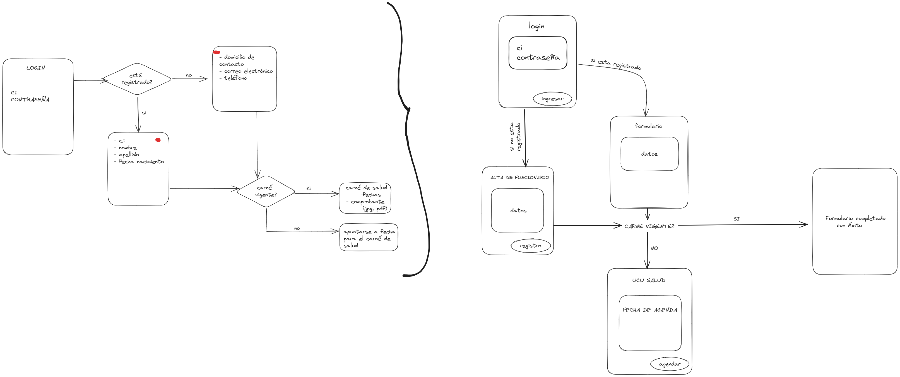

# Obligatorio Bases de Datos - segundo semestre 2023 - Formulario Carnet de Salud de Funcionarios
Integrantes:
Matías Varela, León Salvo, Florencia Roldós, Floriana Locatelli

## Descripción del Proyecto
La aplicación permite a los funcionarios cargar sus carnets de salud y almacenar la información en una base de datos. 
Se utilizó la tecnología Blazor para el desarrollo de la interfaz de usuario y ASP.NET Core para la lógica del servidor.

## Características Principales

- **Formulario de Carga:** Permite a los usuarios cargar y asociar los carnets de salud de los funcionarios.
- **Base de Datos:** Se utilizó una base de datos relacional SQL para almacenar la información de los carnets de salud de los funcionarios de la institución.
- **Seguridad:** Se implementaron medidas de seguridad para proteger la información sensible.

## Requisitos 

- [Docker](https://www.docker.com/get-started)
- [.NET SDK](https://dotnet.microsoft.com/download) versión 6.

## Configuración del Proyecto

Clona este repositorio: `https://github.com/floroldos/ObligatorioBD2023.git`

## Uso

1. Iniciar la Aplicación con Docker Compose
Ejecutar `docker-compose up` para levantar la aplicación y su base de datos.

2. Compilar y Ejecutar en consola.
  Dentro del directorio de la aplicación, ejecutar:
  `dotnet watch`
  Este comando compilará la aplicación y la ejecutará. La opción watch permitirá que la aplicación se reinicie automáticamente cuando se realicen cambios en el código.
  En caso de no funcionar, utilizar  `dotnet build` seguido de `dotnet run`.

4. Acceder a la Aplicación
Abrir navegador y acceder a la aplicación en http://localhost:5199.

## Detalles de flujo del programa

Se tienen dos dsitintas páginas de login.
# Login de funcionarios
- Es la página principal que recibe al usuario al ingresar. Allí cualquier funcionario puede acceder con su cédula y contraseña a la plataforma.
- Si las credenciales son correctas, se redirige al usuario al formulario de actualización, en 'http://localhost:5199/formulario'.
- Si las credenciales no son correctas, se le notifica al funcionario a través de una alerta. Creemos importante mencionar que se realiza un control del largo y tipo de la cédula ingresada. Además, se realiza una consulta a la bases de datos para verificar la contraseña ingresada. En este paso se cifra la contraseña con MD5 por temas de seguridad.
# Login de administradores
- En la página 'http://localhost:5199/admin', se pide cédula y contraseña para ingresar. Cuando se inicia sesión se controla el largo y tipo de la cédula. Por último, se realiza una consulta a la base de datos para verificar si la contraseña ingresada es correcta. En este paso se cifra la contraseña con MD5 por temas de seguridad.

# Formulario de actualizacion
- Una vez iniciada la sesión, se redirige al funcionario a 'http://localhost:5199/formulario'. En esta página se le pide al usuario que ingrese datos adicionales requeridos para completar el formulario, como nombre, apellido y fecha de nacimiento. Cabe mencionar que se realiza un control sobre la cédula de identidad. Una vez que el usuario manda sus datos, se redirige a 'http://localhost:5199/Carnet'.

# Subir carnet de salud
- En esta página se le pregunta al funcionario si tiene su carnet de salud vigente.
    - En caso de tenerlo vigente, se desplegan campos para que el funcionario ingrese, como imágen comprobante, fecha de emisión y de vencimiento. Cuando el usuario adjunte sus datos y envíe el formulario, se insertan los datos del carnet de salud en la base de datos.
    - En caso de no tenerlo vigente, se le notifica al funcionario que debe tenerlo al día, e invita al funcionario a agendarse una consulta médica para actualizarlo.

# Registro agenda
- Cuando el funcionario selecciona la opción de agendarse a una consulta, se navega a 'http://localhost:5199/RegistroAgenda'. Allí,

## Diagrama visual

